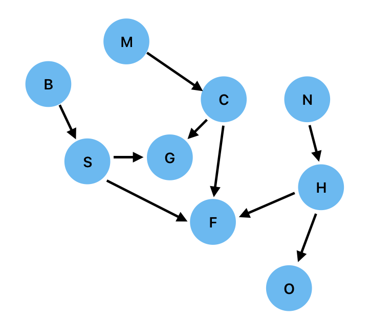
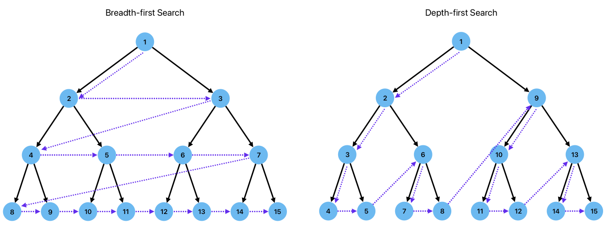

# Automating Natural Deduction

Natural Deduction is very similar in principle and practice to mathematical proof: to show that some statement is true, we take some statements that we know to be true and perform a series of well-defined symbol manipulations until we are able to produce the statement that we wish to prove. This is all quite straightforward when we have a small number of statements to work with, but this soon becomes very challenging with large numbers of statements, because of the combinatorial possibilities. In any case, performing the derivations needed to prove new statements can become rather tedious once one has learned how to do it. It is natural to want to automate this, and Kanren is one such tool that can do this (with limitations).

The rules of natural deduction are not easy to apply mechanistically and indeed Kanren and other logic programming environments do not do this. As humans, we use our intuition to figure out what rules to apply, and in what order. The computer has no such in-built intuition, and we have not yet understood how to properly program or train computers to emulate our human intuition (LLMs do so inconsistently). We could, of course,  systematically and sequentially apply all possible rules until we arrive at the target statement that we want to prove, but with many possible rules and the potential for large knowledge bases, this becomes impractical very quickly.

An automated approach to natural deduction would be much simpler to implement if there was some uniformity in the statements that make up the knowledge base. Fortunately, the rules of logic make it possible for us to do this relatively easily. Consider the logical statements $P\implies Q$, $P\land Q$, and $P\lor Q$. We have seen how to manipulate these statements in a proof (noting that `or` is not at all straightforward to work with). If we could represent our knowledge using only one of these operators, natural deduction would be far more straightforward. Fortunately, this turns out to be quite a simple thing to do. Consider the truth tables for these operators:

| $P$ | $Q$ | $P\land Q$ | $P\lor Q$ | $P\implies Q$ |
|:---:|:---:|:----------:|:---------:|:-------------:|
| F   | F   | F          | F         | T             |
| F   | T   | F          | T         | T             |
| T   | F   | F          | T         | F             |
| T   | T   | T          | T         | T             |

It is very easy to verify from the truth table that the following relationship between these operators hold (allowing the use of `not` as well):

$$P\land Q \equiv \lnot(P\implies\lnot Q)\quad \leftrightarrow\quad P\implies Q \equiv \lnot(P\land\lnot Q)$$

$$P\lor Q \equiv \lnot P\implies Q \quad \leftrightarrow\quad P\implies Q \equiv \lnot P\lor Q$$

These relations allow us to rewrite any knowledge base in terms of **material implication** and `not`. This representation of a knowledge base is sometimes called a **rule-based system** and it permits a very powerful approach to inference in which we need just one inference rule: *modus ponens*.

We will study two ways to draw inferences from such a system. In the first, we will start with the rules of the knowledge base and combine them in different ways until we reach the statement that we are trying to prove (the goal). In the second, we start with the goal, and work backwards to see if it is compatible with the known facts. Both approaches rely on being able to systematically *search* the knowledge base to find those facts that are compatible with the goal.

## Forward Chaining

Consider a Knowledge Base expressed in terms of material implications. Given a few initial facts, we want be able to determine new information from the knowledge base. Consider this very simple example:

1. If animal goes "moo" then animal is a cow.
2. If animal goes "neigh" then animal is a horse.
3. If animal goes "baa" then animal is a sheep.
4. If animal is a cow then animal eats grass.
5. If animal is a horse then animal eats oats.
6. If animal is a sheep then animal eats grass.

Let us now assume that we know the sound that a particular animal makes - let's say the animal goes "neigh".

Can we use our rule base to derive what that animal eats? Yes we can, by repeated application of *modus ponens*.

* We first check to see if we can find a rule for which, given our  fact, the antecedent is True. We find that it is so for rule 2.
* By modus ponens, we can now take the consequent of rule 2 to be true ("animal is a horse") and look again at the rules to see if any of the antecedents are true. We find that this is the case for rule 5.
* By modus ponens on rule 5, we find that "animal eats oats" must be true.

This styles of inference - sequential application of modus ponens - is known as **forward chaining**.

## Backward Chaining

Backward chaining starts with a goal statement, and aims to determine whether the goal is consistent with the knowledge base. 

Let us imagine that we know a fact about another animal:

- animal goes "moo"

This time, let us imagine we have a hypothesis that we want to test: "animal eats grass". This is our "goal" statement. Notice the difference between how this problem is framed compared to the previous example.

Here is how we proceed:

* We check all of the consequents to see if any of them match the goal. Rules 4 and 6 match. We cannot infer anything immediately: not only are their two rules that match our goal, we cannot infer that the antecedent os a rule is true if the consequent is true as this a logical fallacy (affirming the consequent). What we can do though if to take the antecdents of the matching rules and create new goals: "animal is a cow" and "animal is a sheep".
* We now try to matching our new goals against the consequents of our rules. we find that rules 1 and 3 match. Repeating the same process, we obtain two new goals: "animal goes moo" and "animal goes baa".
* One of these subgoals, "animal goes moo" was stated as an initial fact and so the goal is satisfied.
* Having determined that there is a "path" through our rules between our facts and our hypotheis, we can propagate back the other way through applications of modus ponens, firstly on rule 1 to deduce "animal is a cow" and then through rule 4" to deduce that "animal eats grass" and hence that our hypothesis was true.

## A Comparison of Forward vs Backward Chaining

Forward and backward chaining have different use-cases. Forward chaining starts with the facts and uses them to derive new facts. This process can happen dynamically, and so if we learn something new and add it to the knowledge based, we can use forward chaining to derive new facts without any particular goal in mind. For example, we can derive the following new rules from our rule base

1. If animal goes "moo" then animal eats grass [rules 1+4];
2. If animal goes "neigh" then animal eats oats [rules 2+5];
3. If animal goes "baa" then animal eats grass [rule 3+6].

These can then be added to the knowledge base, which can then grow dynamically as new facts are added. Thus, forward chaining can be used without necessarily having a specific goal/question in mind.

If we have a specific hypothesis that we wish to test (does an animal eat grass?) then we can of course answer this using forward chaining, but one drawback of this is that since forward chaining starts with the known facts and tests the antecedents of our rules, we do not know whether the desired goal is a possible consequent of any of the rules. Consider what would happen if we made our goal the hypothesis "animal eats corn". We would have to follow all possible forward paths through the rule base to determine that there was no consequent that would confirm the hypothesis. With backward chaining, which is said to be *goal-driven*, we test the consequents first, so if "animal eats corn" is not found in the set of possible consequents we know that we can immediately reject the hypothesis. Backward chaining also invokes only those rules that can lead to the desired consequent and thus can be much more efficient. With forward chaining, it is possible to head down dead-end pathways. Forwards and Backward Chaining are therefore employed with different tasks in mind (typically open vs closed questions). 

## Proof and Search

In forward and backward chaining, we will often have a choice of rules that we can invoke. Consider the following slightly artificial example of a rule base:

1. If animal goes "moo" then animal is a cow.
2. If animal goes "baa" then animal is a sheep.
3. If animal goes "neigh" then animal is a horse.
4. If animal is a cow then animal eats grass.
5. If animal is a sheep then animal eats grass.
6. If animal is a horse then animal eats oats.
7. If animal is a cow then animal has four legs.
8. If animal is a sheep then animal has four legs.
9. If animal is a horse then animal has four legs.

One important and natural way to think about inference on this problem is as *search on a graph*. Using the notation $M$: goes "Moo", $C$: is a Cow etc we define our graph with a node for each antecedent/consequent, and an arrow that links the antecedent to its consequent, as shown below:

In these terms, forward chaining involves following the arrows, allowing to easily see that if an animal goes "baa" then it must eat grass (path $B\rightarrow S\rightarrow G$). Conversely backward chaining requires us to move counter to the arrows and we can easily see that if we know as a fact that an animal goes "neigh" (ie, that $N$ is True), then the goal $O$ (eats oats) can be proven by following the backward path $O\leftarrow H\leftarrow N$.

The graphical representation allows us to see an immediate challenge: in both forward chaining and backward chaining, we can have *choices*. In forward chaining, the choice comes when we have multiple possible outgoing arrows to follow. For example, from node $C$ we can traverse to both $G$ and $F$, and we have no way to know which will get us to our goal. In backward chaining, we have to make choices at nodes with multiple incoming arrows, for example node $G$. If we are trying to prove $G$ via backward chaining we have a choice of which arrow to follow backwards first, and whether $C$ or $S$ should be the new subgoal.

How do we make these choices to ensure that we are fully exploring the graph, and doing so efficiently? We need to **search** the graph systematically. There are two comon ways to do this which we will illustrate via examples of backward chaining.

### Breadth-first Search

Consider the hypothesis/goal "Jeff eats grass" ($G$) given the fact "Jess goes 'moo'" (ie $M$ is True). There are several ways in which a solution to this problem could be reached, because there are multiple rules that have consequents that match our goal, i.e. multiple arrows into $G$ from $C$ and $S$.

In breadth-first search, we divide the graph into layers that are the same distance (number of connections) from our starting node $G$, and we search each layer exhaustively, either stopping when we have found a node that solves our problem or moving on to the next layer when we have examined all nodes in the current layer. In this example:

- We start at the goal node $G$.
- In the first layer, we have two nodes $C$ and $S$ that have direct connections into $G$. We examine both of these nodes to see whether they solve the problem (ie is either $C$ or $S$ true?). Neither of these nodes is known to be True so they do not prove our goal. We must therefore look at the next layer of nodes, those that have connections into $G$ and $S$.
- The next layer of nodes contains $B$ and $N$. We first examine $B$ and find that we do not know whether this is True. We then examine $M$ and find that this node is True because it was given as an initial fact. We have therefore proven our goal statement $G$ as we have found a direct path $M\rightarrow C\rightarrow G$ to our goal from a known fact.

If we were to solve the same problem via breadth first search applied to forward chaining, we would approach it in the following way:

- Our goal is $G$
- We start at known fact $M$
- Search layer one, which contains only node $C$. This does not satisfy our goal.
- Search layer two, which contains $F$ and $G$. $F$ does not satisfy our goal, but $G$ does, thus proving $G$ to be True.

### Depth-first Search

Let us consider the same problem by a different approach. In depth-first search we again structure the nodes into layers, but instead of searching each layer exhaustively before moving on to the next layer, we follow the connections to further layers, stopping only when we find a solution and cannot go any further. At this point, we track back a layer and follow the connections deeper. In this example, we proceed as follows:

- As before, we start at the goal node $G$.
- Layer 1 contains $C$ and $S$. We choose one of these, say $S$ and evaluate it. $S$ is not know to be True, and so we proceed to search those nodes that have connections into S ($B$).
- $B$ is not known to be True, and has no incoming arrows so we cannot continue any further.
- We therefore backtrack to $G$ and then examine the next node in layer 1 ($C$) which is not know to be True.
- We then examine the nodes that connect into $C$, which is just $M$ and we know that $M$ is True. We have therefore proven our goal. 

Depth-first forward chaining for the same problem would proceed as follows:

- Our goal is $G$.
- We start at known fact $M$
- Examine $S$ which does not satisfy our goal.
- Examine the nodes that connect to $S$ ($B$) which do not satisfy our goal.
- Examine $C$ which does not satisfy our goal.
- Examine the nodes that connect to $C$ ($M$) which does satisfy our goal.

These two approaches are illustrated graphically in the following figure using the example of a balanced binary tree for simplicity, but the principles is readily transferrable to any graph.

### Breadth- vs depth-first Searching

Given a choice of two strategies for graph search, and hence for rule-based inference, it is natural to ask "which method should I use?". The answer to this question is, perhaps inevitably, that "it depends".

We might be tempted to select a method based on space/time complexity, but these are the same for both approaches. The time complexity depends on both the number of nodes/vertices $\lvert V\rvert$ and the number of edges/arrows $\lvert E\rvert$, and is expressed as $\mathcal{O}(\lvert V\rvert+\lvert E\rvert)$. The space complexity, on the other hand, depends only on the number of vertices and is $O(\lvert V\rvert)$.

In practice depth-first is usually preferred because it permits a simple recursive implementation. However, great care must be taken to ensure that there are no "cycles" in the graph because otherwise depth-first search will get stuck in a cycle. Breadth-first approaches are sometimes useful when you want to find the shortest chain of reasoning that leads to a particular outcome, but this is a relatively niche application.
