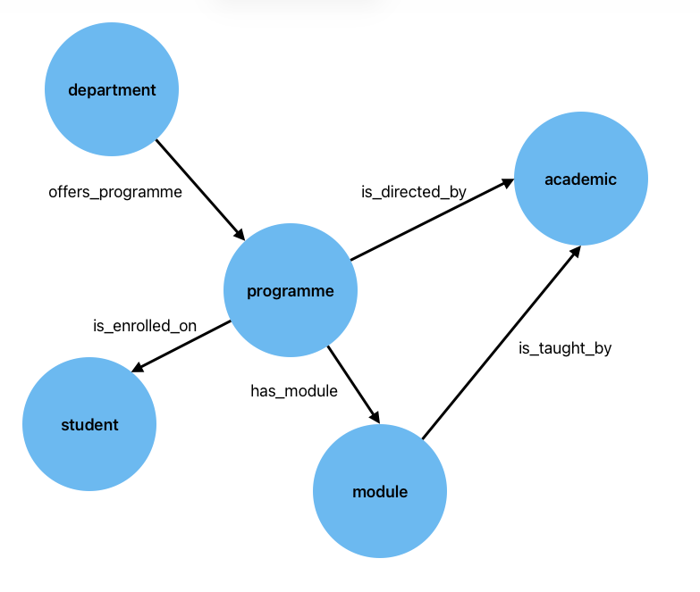

# Solutions to Exercise 9: Designing a Simple Knowledge Graph

Consider the following familiar situation. A University department teaches students, who are enrolled on different modules.

* Schools offer degree programmes
* Programmes contain multiple modules
* Students are registered on a programme
* Each module has a designated member of staff who is responsible for the teaching of that module.
* Each programme has a designated director.

With this in mind, can you suggest a graph that would model this situation? What entities are required? What relations are needed between them?

## Solution

The entities are straightforward and we need:

* `school`
* `programme`
* `module`
* `staff_member`
* `student`

The relations (predicates) are then

* `offers_programme(school, programme)`
* `has_module(programme, module)`
* `is_enrolled_in(student, programme)`
* `is_taught_by(module, staff_member)`
* `is_directed_by(programme, staff_member)`

Graphically we have:
