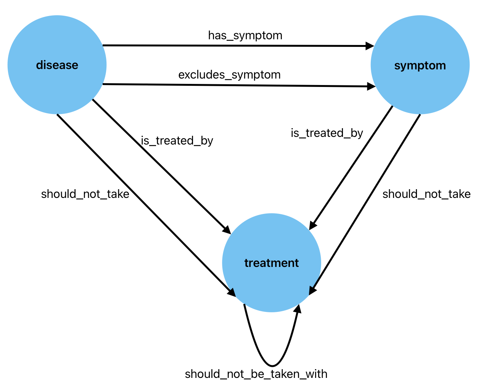

# Solutions to Exercise 9: A more complex Ontology

Consider the following (fictitious) problem. You are designing a knowledge base for a medical practice. The knowledge base needs to model a range of diseases, their symptoms, and potential medicines that could be used to treat them. To help with the design of the knowledge graph, the practice has provided you with some representative examples of the knowledge that the graph needs to be able to represent. Given this knowledge, can you design an ontology (in graphical form) that could be used to represent this knowledge, and future knowledge that might be added later.

The diseases are:

* Acidulitis
* Brachioma
* Calicosis
* Divertigo
* Ecnomia

Symptoms include:

* Fever
* Glandular swelling
* Headache
* Itching
* Jaundice

Available treatments are:

* Kaloxin
* Lorapix
* Manigel
* Nimbalex
* Optinox

The following facts are known

* The symptoms of Acidulitis are Headache and/or Itching, without Glandular Swelling.
* One of Brachioma's symptoms is Fever.
* Patients with Calicosis should not take Optinox.
* The symptoms of Divertigo are Glandular Swelling with either Itching and/or Jaundice.
* The symptoms of Ecnomia are Fever with Glandular Swelling and/or Jaundice.
* Itching is a symptom of either Divertigo or Ecnomia.
* Kaloxin should not be used if Fever is a symptom.
* Lorapix should not be used if Jaundice is a symptom.
* Manigel and Optinox should never be used together.
* Headaches can be treated with either Lorapix or Nimbalex.
* Headache means the disease cannot be Ecnomia.
* Kaloxin and Nimbalex should never be used together.

## Solutions

The entities we need are quite straightforward. We have:

* `disease`
* `symptom`
* `treatment`

Some of the relations are quite easy. We can identify:

* `has_symptom(disease,symptom)`
* `is_treated_by({symptom,disease},treatment)`
* `should_not_be_taken_with(treatment,treatment)`

We also need

* `excludes_symptom(disease,symptom)` which is stronger than the absence of a symptom (which could be the result of a lack of knowledge)
* `should_not_take({symptom,disease}, treatment)`

Graphically we have:

