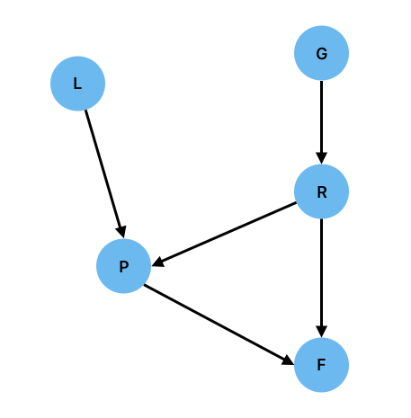
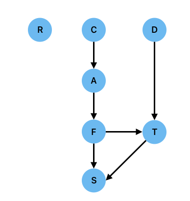

# Bayesian Networks

Consider the following (very simplified) model of molecular biology. A biological function $F$ depends, at the molecular level, on four type of molecule. At the lowest level are the *genes*, $G$, which are the basic "code of life". The genes are transcribed (read) to produce *RNA* ($R$) which has two roles. Non-coding RNA can perform functions by itself, whilst messenger RNA (mRNA) enables the production of *proteins* $P$. Proteins also perform functions, and are modified by small molecules called *ligands* $L$.

Biology is noisy and messy with many factors that can affect, for example, the transcription of a gene into the RNA that it codes for, and so it makes good sense to model the five things $(G,R,P,L,F)$ as random variables with a corresponding joint probability distribution $P(G,R,P,L,F)$.

This distribution would be formidably hard to work with. Principally, it would be incredibly difficult to determine what the values in the distribution are. In humans there are roughly:

* Tens of thousands of Genes
* Hundreds of thousands of RNA strands.
* Tens of thousands of proteins
* Hundreds of thousands of ligands
* Hundreds of thousands of functions.

The total number of elements in the multidimensional array (often called a tensor) $P(G,R,P,L,F)$ is of order *at least* $10^18$ - intractable. Simply storing this would require 8 Exabytes which is thought to be roughly the total amount of storage in all of Google's datacentres combined.

Although this might seem like a hopeless situation, we do have some useful tools to help us overcome this. For example, if we were to assume statistical independence $P(G,R,P,L,F) = P(G)P(R)P(P)P(L)P(F)$ then the number of parameters in each of these distributions is the number of possibilities for that "thing" (eg $P(G)$ will have tens of thousands of elements). The total number of parameters would be reduced to around a million, requiring a mere 8MB of storage, which is trivial for us today.

The assumption of independence that we would have to make to do this would, however, not be reasonable or acceptable. We **know** that there are clear links between some of these things and they are definitely not independent: the probability that a particular protein is expressed definitely depends on what RNA sequences are present, and these in turn depend on what genes are present.

Fortunately, there are options open to us beyond treating the random variables as independent. In fact, the product rule of probability allow us a large amount of freedom over how we model the distribution. Recalling the definition of the product rule $P(X,Y)=P(X\vert Y)P(Y)$, we can factorise $P(G,R,P,L,F)$ as a product of univariate distributions in *any* of the following ways (and there are many more possibilities):

* $P(G,R,P,L,F) = P(L\vert R)P(R\vert P)P(P\vert G)P(G\vert F)P(F)$
* $P(G,R,P,L,F) = P(G\vert L)P(L\vert F)P(F\vert P)P(P\vert R)P(R)$
* $P(G,R,P,L,F) = P(R\vert L)P(L\vert G)P(G\vert F)P(F\vert P)P(P)$

Why is this useful and desirable? There are two pragmatic reasons for this:

1. The number of parameters needed to characterise the distribution is much reduced.

2. It is rarely possible, in real problems, to measure the joint distribution directly. In most practical situations we may observe a small number of variables whilst controlling the others. Factorisation of the joint distribution in terms of things that we can observe may, some circumstance be important if not necessarily optimal.

However, neither of these reasons helps us to answer an important question: **which factorisation should we choose**? To answer this question, we have to think hard about the problem we are working with, and about the relationships between the variables. What do we know?

First, we know that the presence of RNA results from transcription of the Genes. It doesn't depend on any of the other variable. It therefore seems plausible that our factorisation should include $P(R\vert G)$. 

Secondly, the presence of the Genes is not dependent on any of the other variables, so including $P(G)$ seems reasonable.

Thirdly Proteins depend on RNA, so we might include $P(P\vert R)$. But they are also dependent on the ligands (which modify them) so the precise protein present depends on both $R$ and $L$, so we should include $P(P\vert R,L)$. 

Ligands themselves are independent of everything else (they are just there) and so we include $P(L)$.

Finally, function $F$ depends directly on both Proteins and RNA, so we include $P(F\vert P,R)$.

This gives us a factorisation:

$P(G,R,P,L,F) = P(F\vert P,R)P(P\vert R,L)P(R\vert G)P(L)P(G)$

In graphical form, this can be drawn as

This is an example of a **Bayesian Network**. It is a valid factorisation of the joint distribution, and it is structured in such a way as to reflect the **causal relationships** in the problem. 

## Formal definition of a Bayesian Network

A Bayesian network is a representation of a suitably factorised probability distribution as a *directed graph* in which

1. Each node represents a single random variable (discrete or continuous)
2. Edges between nodes represent conditional relationships and are directed from the "conditioner" (or *parent*) node to the "conditioned" node
3. Each node has an associated conditional probability distribution with the variable associated with the node conditioned on it "parents"
4. "Orphan" nodes with no parents represent variables that are unconditionally independent.
5. The graph must be strictly acyclic: it is a **directed acyclic graph** (DAG).

The DAG naturally and visually conveys the structure and relationships within the factorised joint distribution, and it is trivial to map between the DAG and the factorised distribution. The edges in the graph convey "influence" or, more strongly, "causation" ("Genes cause RNA, RNA and Proteins cause Function). Since nodes in the graph represent variables, each node has an associated probability distribution that is conditioned on the incoming arrows.

One of the nicest features of Bayesian Networks is that there is a unique, unambigious relationship between the diagram and the factorisation of the joint probability distribution. This means that all of your "thinking" can be done using the diagrams, and when you are satisfied that you have a diagram that represents the relationships, you can simply write down the factorisation.

## A method for constructing Bayesian Networks

There is a nice well-defined recipe for constructing a Bayesian network which amounts to 

Let us begin by reminding ourselves of the conditional factorisation of the joint distribution. We assume an arbitraty ordering of the variables which can be changed at will.

$P(X_1,\dots,X_N) = P(X_1)\prod_{i=2}^N P(X_i\vert X_{i-1},\dots,X_1)$.

This is called the **chain rule**. It requires an ordering to be imposed on the random variables and we will suggestively write as a shorthand that

$P(X_i\vert X_{i-1},\dots,X_1) = P(X_i\vert\mathrm{parents}(X_i))$

where $\mathrm{parents}(X_i)$ are a subset of ${X_{i-1},\dots,X_1}$. We can do this very simply in the graph by making sure that the nodes are appropriate ordered such that those nodes that are closer to the start of the DAG and have no incoming edges (ie orphans with no parents) are lower in number that those with incoming edges. The question is, how to achieve this?

The Chain rule implies that a Bayesian network properly represents its domain if each node is conditionally independent of its predecessors in the ordering, given its parents. Here is a procedure for acheiving this:

1. Choose the variables needed to model the domain and order them. A good ordering has causes preceding effects.

2. For each node, choose a set of parents such that the chain rule is satisfied and that the parents can plausibly represent causes of the node's effect.

3. Add edges directed from parents to the node.

4. Write down a conditional probability table for the node.

Let's work through a simple example. Consider the following slightly ridculous chain of events:

You are cooking in your kitchen. It is raining outside, and the neighbour's dog is loose. You accidently set fire to a pan of oil. The fire spreads and soon the house is on fire. You call the fire service who come and douse the fire. Whilst the fire service are there, they rescue your cat, which is stuck up a tree.

What are the relationships here? How can we model this with a Bayesian network? First, let's identify what the variables are

* You are cooking $C$
* It is raining $R$
* The neighbour's dog is loose $D$
* Accident in kitchen $A$
* House on fire $F$
* Call fire service $S$
* Cat in tree $T$

We have seven variables here, each of which is a binary random variable. The Joint distribution therefore has $2^7-1=127$ independent parameters. Our factorisation will greatly reduce this.

What is the proper ordering of variable here? We need to work out what the causative chain of events might be.

Firstly, you are cooking. This probably does not depend on any of the other variables and so will have no parents. Whether it is raining and whether the dog is loose are also most likely to the orphan nodes.

The accident in the kitchen clearly depends on whether your are cooking; the house on fire depends on the accident. Calling the fire service depends on the hour being on fire.

The cat might be in the tree because of the dog, and also potentially because of the fire. You might also call the fire service for a stuck cat (at least in British stereotyping).

Putting this reasoning together, we draw the following DAG:

This factorise the problem as follows:

$P(C,R,D,A,S,F,T) = P(R)P(C)P(D)P(A\vert C)P(F\vert A)P(T\vert F,D) P(S\vert F,T)$

Can we ascribe some rough probabilities to these events? Let's say there is a 30\% chance that it is raining,

| $P(R)$ | $P(\lnot R)$ |
|:------:|:------------:|
| 0.3    | 0.7          |

On any given day perhaps you spend 10\% of your time cooking:

| $P(C)$ | $P(\lnot C)$ |
|:------:|:------------:|
| 0.1    | 0.9          |

Your neighbour's dog is often allowed to roam freely:

| $P(D)$ | $P(\lnot D)$ |
|:------:|:------------:|
| 0.5    | 0.5          |

The chance of you having a serious oil fire are is probably quite low, and is conditioned on you cooking:

|           | $P(A\vert C)$ | $P(\lnot A\vert C)$ |
|----------:|:-------------:|:-------------------:|
| $C$       | 0.01          |  0.99               |
| $\lnot C$ | 0.0           |  1.00               |

The probability that the house will catch fire given that you have a serious oil fire is quite high, and there is also a chance the house will catch fire without the oil fire:

|           | $P(F\vert A)$ | $P(\lnot F\vert A)$ |
|----------:|:-------------:|:-------------------:|
| $A$       | 0.30          |  0.70               |
| $\lnot A$ | 0.001         |  0.999              |

The cat being up the tree is much more likely if the dog is free and the house is on fire

|                  | $P(T\vert F,D)$ | $P(\lnot T\vert F,D)$ |
|-----------------:|:---------------:|:---------------------:|
| $D,F$            | 0.99            |  0.01                 |
| $D,\lnot F$      | 0.60            |  0.40                 |
| $\lnot D,F$      | 0.70            |  0.30                 |
| $\lnot D,\lnot F$| 0.01            |  0.99                |

Finally, the probability of calling the fire service is much hire in case of a fire than a stuck cat, and if the house is on fire, the cat being stuck is not going to influence your decision:

|                  | $P(S\vert T,F)$ | $P(\lnot S\vert T,F)$ |
|-----------------:|:---------------:|:---------------------:|
| $T,F$            | 0.99            |  0.01                 |
| $T,\lnot F$      | 0.30            |  0.70                 |
| $\lnot T,F$      | 0.99            |  0.01                 |
| $\lnot T,\lnot F$| 0.001           |  0.999                |

There are 15 independent parameters here - far fewer than are needed to describe the full joint distribution.